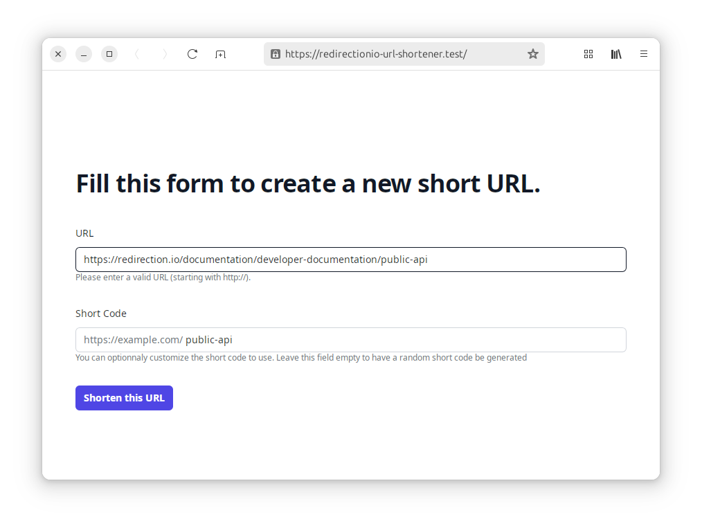

# Example redirection.io URL Shortener

This project is a simple example on how to build a URL Shortener on top of
[redirection.io](https://redirection.io). redirection.io is a powerful tool to manage
redirections, and this project is a simple example of how to use its
[public API](https://api.redirection.io/) to create a URL Shortener.



## Running the application locally

### Requirements

A Docker environment is provided and requires you to have these tools available:

 * Docker
 * Bash
 * [Castor](https://github.com/jolicode/castor#installation)

### Docker environment

The Docker infrastructure provides a web stack with:
 - NGINX
 - PHP
 - Traefik

### Project key configuration

In the `application/.env` file, you need to set the `REDIRECTIONIO_PROJECT_KEY` and some other variables:

```dotenv
REDIRECTION_IO_SHORT_URL_DOMAIN=example.com
REDIRECTION_IO_API_KEY=YOUR_API_KEY
REDIRECTION_IO_PROJECT_ID=YOUR_PROJECT_ID
```

 * `REDIRECTION_IO_SHORT_URL_DOMAIN` is the domain you want to use for your short URLs. It must be a valid domain name. You can configure it in your redirection.io project as a [managed instance](https://redirection.io/documentation/managed-instances/what-are-managed-instances)
 * `REDIRECTION_IO_API_KEY` is the API key you can generate [in your redirection.io organization settings](https://redirection.io/documentation/developer-documentation/public-api).
 * `REDIRECTION_IO_PROJECT_ID` is the ID of the project you want to use for your short URLs. You can find it in your project in the redirection.io dashboard.

> [!NOTE]
> If you need to generate short URLs for a public website, we strongly advise to dedicate a specific (sub-)domain to these URLs. This way, you can manage the redirections in a separate project and avoid any conflict with your main website.

### Domain configuration (first time only)

Before running the application for the first time, ensure your domain names
point the IP of your Docker daemon by editing your `/etc/hosts` file.

This IP is probably `127.0.0.1` unless you run Docker in a special VM (like docker-machine for example).

> [!NOTE]
> The router binds port 80 and 443, that's why it will work with `127.0.0.1`

```
echo '127.0.0.1 redirectionio-url-shortener.test www.redirectionio-url-shortener.test' | sudo tee -a /etc/hosts
```

### Starting the stack

Launch the stack by running this command:

```bash
castor start
```

> [!NOTE]
> the first start of the stack should take a few minutes.

The site is now accessible at https://redirectionio-url-shortener.test
(you may need to accept self-signed SSL certificate if you do not have `mkcert`
installed on your computer - see below).

### SSL certificates

HTTPS is supported out of the box. SSL certificates are not versioned and will
be generated the first time you start the infrastructure (`castor start`) or if
you run `castor docker:generate-certificates`.

If you have `mkcert` installed on your computer, it will be used to generate
locally trusted certificates. See [`mkcert` documentation](https://github.com/FiloSottile/mkcert#installation)
to understand how to install it. Do not forget to install CA root from `mkcert`
by running `mkcert -install`.

If you don't have `mkcert`, then self-signed certificates will instead be
generated with `openssl`. You can configure [infrastructure/docker/services/router/openssl.cnf](infrastructure/docker/services/router/openssl.cnf)
to tweak certificates.

You can run `castor docker:generate-certificates --force` to recreate new certificates
if some were already generated. Remember to restart the infrastructure to make
use of the new certificates with `castor up` or `castor start`.

### Builder

Having some composer, yarn or other modifications to make on the project?
Start the builder which will give you access to a container with all these
tools available:

```bash
castor builder
```

### Other tasks

Checkout `castor` to have the list of available tasks.

## License

This software is published under the [MIT License](LICENSE.md).
